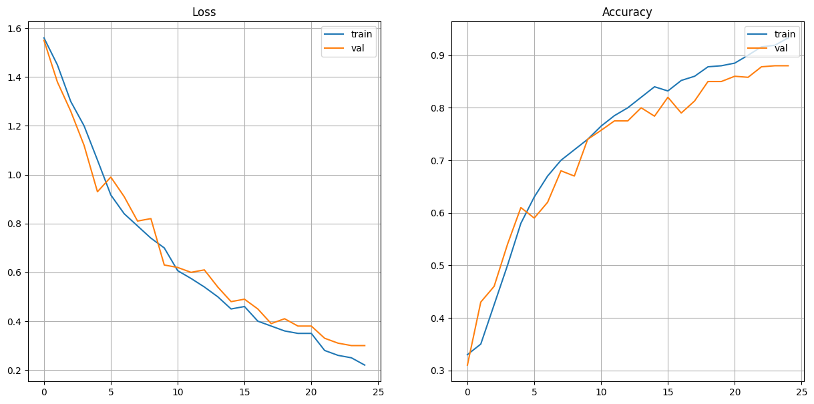

# **Emotion Recognition with Wav2Vec2-XLSR-53-Large - Spanish**

This project utilizes the **Wav2Vec2-XLSR-53-Large - Spanish** model for emotion recognition. The model is fine-tuned to classify the following emotions:

- **Joy**
- **Sadness**
- **Anger**
- **Fear**
- **Neutral**
- **Disgust**

## **Results**

The model achieves a test accuracy of **89.20%**. Below are the performance metrics visualized through a result graph and a confusion matrix:

### **Result Graph**

### **Confusion Matrix**

## **References**

I like to thank 
- Duville, Alonso-Valerdi and Ibarra-zarate for their dedication of the collection of the Mexican Emotional Speech Database Duville, M.M.; Alonso-Valerdi, L.M.; Ibarra-Zarate, D.I. Mexican Emotional Speech Database Based on Semantic, Frequency, Familiarity, Concreteness, and Cultural Shaping of Affective Prosody. Data 2021, 6, 130.
- Garcia-Cuesta, E., Salvador, A. B., & Pãez, D. G. (2023). EmoMatchSpanishDB: study of speech emotion recognition machine learning models in a new Spanish elicited database. Multimedia Tools and Applications, 1-20.
- Ronghao Pan, et al. (2023). Spanish MEACorpus 2023: A multimodal speech–text corpus for emotion analysis in Spanish from natural environments
- [Wav2Vec2-XLSR-53-Large - Spanish](https://huggingface.co/jonatasgrosman/wav2vec2-large-xlsr-53-spanish)
- [Wav2Vec2 - Transfer learning](https://github.com/amansyayf/wav2vec2_emotion_recognition/blob/main/training_module.ipynb)
